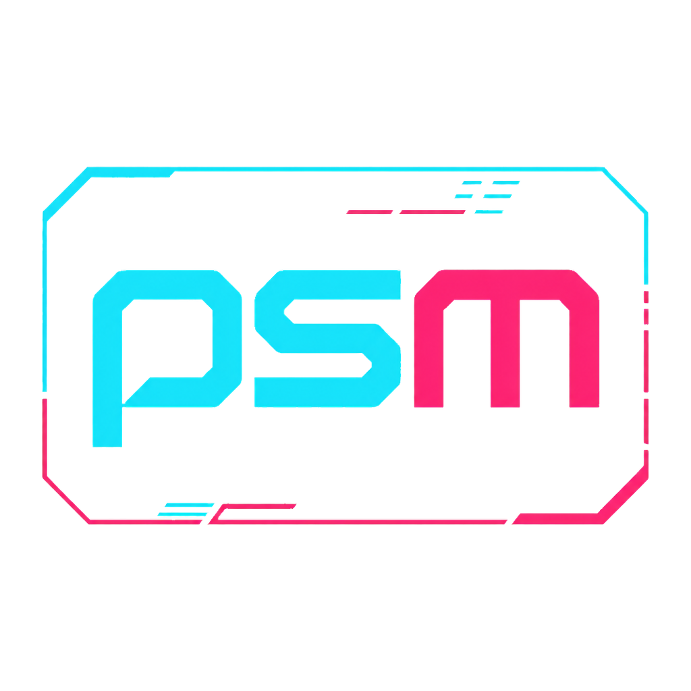

# PSM Console by &gt;GR477&lt;

<p align="center">
  
</p>

PSM Console es una aplicación portable para Windows que instala, configura, inicia y administra un servidor dedicado de Palworld desde una única interfaz.

Está desarrollada con Electron, NestJS y TypeScript. La interfaz no accede directamente al sistema: utiliza una capa IPC tipada, restringida y aislada.

## Descargas

Las versiones publicadas y sus archivos portables se distribuyen desde la página de Releases.

[Ver releases y descargar PSM Console](https://github.com/Alexis190392/psm-console/releases)

Las versiones provenientes de la rama `test` aparecen como prerelease. Las versiones estables se publicarán desde `master`.

## Documentación

- [Manual de usuario](docs/manual-usuario/README.md)

El manual explica la preparación inicial, configuración, administración, backups, red y resolución de problemas mediante capturas de la aplicación.

## Funcionalidades

- Detecta, descarga y valida SteamCMD con confirmación explícita.
- Instala, actualiza y repara Palworld Dedicated Server.
- Crea y edita `PalWorldSettings.ini` mediante controles agrupados y perfiles.
- Crea backups, verifica su integridad y los restaura de forma segura.
- Revisa Firewall de Windows, acceso local y datos de conexión pública.
- Inicia, detiene y supervisa el servidor con logs en tiempo real.
- Habilita controles de administración, jugadores y mundo mientras el servidor está activo.
- Expone un panel web compartido con perfiles administrativo y cliente, credenciales independientes y permisos configurables.
- Verifica progresivamente el acceso web desde este equipo, la red local e Internet.
- Conserva las sesiones web mientras PSM Console permanece abierta y aplica los permisos del cliente en tiempo real.

## Interfaz


<p align="center">
  
  
</p>

### Acceso web


La misma interfaz se adapta a teléfonos y equipos de escritorio, conserva la identidad Tactical HUD de la aplicación y muestra solamente las funciones autorizadas para cada perfil.

## Requisitos

### Para usar el portable

- Windows 10 u Windows 11 de 64 bits.
- Conexión a Internet solo para descargar SteamCMD, el servidor o consultar la red pública.
- Aprobación de administrador únicamente cuando sea necesario crear o actualizar reglas del Firewall de Windows.

### Para desarrollar desde el código fuente

- Windows 10 u Windows 11 de 64 bits.
- Node.js 22.x.
- npm 10.x.

```powershell
npm.cmd install
npm.cmd run start:dev
```

`start:dev` utiliza `ejecucionPruebas/` como directorio aislado, por lo que las descargas y datos de prueba no afectan una instalación portable.

## Uso rápido

1. Abre PSM Console y revisa el estado del entorno.
2. Confirma las descargas de SteamCMD o del servidor cuando la aplicación las solicite.
3. Ajusta la configuración y guarda los cambios.
4. Revisa el Firewall local y configúralo desde la aplicación si es necesario.
5. Inicia el servidor, consulta los logs y copia la dirección local o pública para compartirla.

## Estado del proyecto

Versión actual: `0.17.7 Dev`.

Palworld, Steam y SteamCMD son marcas de sus respectivos propietarios. Este proyecto es una herramienta independiente y no está afiliado con Pocketpair ni Valve.
