# Manual de usuario de PSM Console

Este manual explica cómo preparar, configurar y administrar un servidor dedicado de Palworld mediante PSM Console. No requiere conocimientos de consola ni de SteamCMD.

> Las direcciones mostradas en las capturas son ejemplos reservados para documentación. No corresponden a la red real del autor.

## Contenido

1. [Requisitos](#1-requisitos)
2. [Primer inicio](#2-primer-inicio)
3. [Pantalla General](#3-pantalla-general)
4. [Configurar el servidor](#4-configurar-el-servidor)
5. [Red y Firewall](#5-red-y-firewall)
6. [Iniciar y detener el servidor](#6-iniciar-y-detener-el-servidor)
7. [Administración en ejecución](#7-administración-en-ejecución)
8. [Backups](#8-backups)
9. [Logs](#9-logs)
10. [Configuración de la aplicación](#10-configuración-de-la-aplicación)
11. [Actualizaciones](#11-actualizaciones)
12. [Problemas frecuentes](#12-problemas-frecuentes)

## 1. Requisitos

- Windows 10 u Windows 11 de 64 bits.
- Conexión a Internet para descargar SteamCMD y Palworld Dedicated Server.
- Espacio libre suficiente para el servidor, sus actualizaciones, partidas y backups.
- Permisos de administrador solamente cuando Windows solicite configurar el Firewall.

PSM Console es portable. Coloca el ejecutable en una carpeta propia antes de abrirlo, porque el servidor y sus datos se guardarán junto a la aplicación.

Ejemplo:

```text
D:\PSM Console\
  PSM-Console-vX.Y.Z.exe
```

No ejecutes el portable desde una carpeta temporal, dentro de un archivo comprimido ni desde una ubicación que se limpie automáticamente.

## 2. Primer inicio

Al abrir PSM Console por primera vez:

1. El logo aparece mientras se prepara la ventana principal.
2. La aplicación revisa la carpeta portable y las dependencias disponibles.
3. Si SteamCMD no está instalado, muestra una confirmación antes de descargarlo desde el sitio oficial.
4. Cuando SteamCMD esté listo, solicita confirmación para instalar Palworld Dedicated Server.
5. Si falta `PalWorldSettings.ini`, crea una configuración inicial válida.
6. La pantalla General queda disponible cuando termina la preparación.

Las descargas, instalaciones y modificaciones importantes siempre requieren confirmación visible.

### Carpetas creadas

La aplicación organiza sus datos dentro de la carpeta del portable:

| Carpeta | Contenido |
| --- | --- |
| `tools/` | SteamCMD y herramientas necesarias. |
| `server/` | Palworld Dedicated Server y su partida. |
| `config/` | Preferencias propias de PSM Console. |
| `backups/` | Copias del INI y del mundo. |
| `logs/` | Registros de ejecución de la aplicación. |

No elimines estas carpetas mientras el servidor esté en ejecución.

## 3. Pantalla General

General presenta el estado operativo sin obligarte a recorrer todas las secciones.

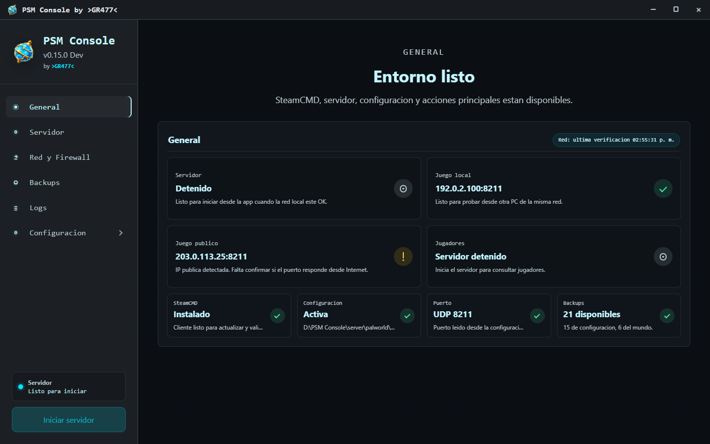

### Estados principales

- **Servidor:** indica si está detenido, iniciando, ejecutándose o requiere revisión.
- **Juego local:** muestra la dirección LAN para jugadores conectados a la misma red.
- **Juego público:** muestra la dirección pública detectada y si la conexión externa fue verificada.
- **SteamCMD:** confirma que la herramienta está instalada.
- **Configuración:** informa si el INI está disponible.
- **Puerto:** muestra el puerto UDP configurado para los jugadores.
- **Backups:** resume las copias disponibles.
- **API web:** abre su configuración cuando todavía no tiene credenciales y muestra su dirección y disponibilidad una vez configurada.

### Copiar direcciones

- Haz clic sobre **Juego local** para copiar `IP:puerto` cuando el estado sea correcto.
- Haz clic sobre **Juego público** para copiar la dirección pública cuando esté disponible.
- Haz clic sobre **API web** para copiar su dirección cuando el acceso esté confirmado.
- Si aparece una advertencia, usa su icono para abrir Red y Firewall y revisar el diagnóstico.

La disponibilidad pública no bloquea el inicio del servidor. Es posible jugar por LAN aunque el acceso desde Internet todavía necesite configuración.

## 4. Configurar el servidor

La sección **Servidor** edita `PalWorldSettings.ini` mediante controles comprensibles.

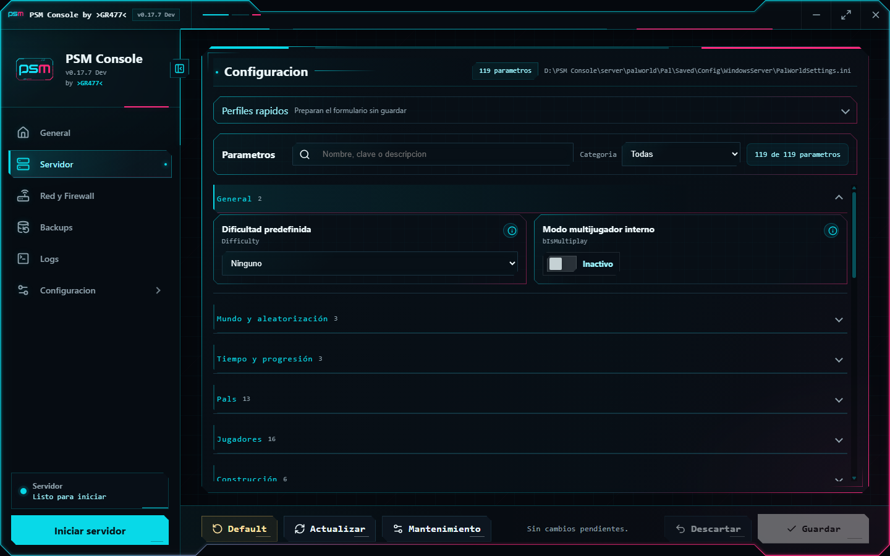

### Buscar parámetros

Puedes localizar una opción mediante:

- Nombre visible en español.
- Nombre técnico del parámetro.
- Texto de su descripción.
- Filtro por categoría.

El contador indica cuántos parámetros coinciden con el filtro actual.

### Tipos de controles

- **Interruptor:** activa o desactiva una opción.
- **Desplegable:** permite elegir únicamente valores admitidos.
- **Control deslizante:** ajusta valores dentro de un rango.
- **Campo numérico o de texto:** permite introducir un valor específico.
- **Icono de información:** abre la explicación del parámetro al hacer clic.

### Perfiles rápidos

Los perfiles aplican un conjunto de valores al formulario. No modifican el archivo hasta presionar **Guardar**.

Revisa los cambios antes de guardarlos, especialmente si ya existe una partida.

### Guardar cambios

1. Modifica los parámetros deseados.
2. Revisa el indicador de cambios pendientes.
3. Presiona **Guardar**.
4. Confirma la operación.

Los cambios sin guardar permanecen disponibles al navegar por la aplicación durante la sesión actual.

### Otras acciones

- **Default:** prepara los valores iniciales del servidor. Requiere confirmación.
- **Actualizar:** vuelve a leer el INI activo.
- **Mantenimiento:** habilita acciones adicionales sobre la configuración.
- **Descartar:** elimina los cambios pendientes del formulario.
- **Ver INI avanzado:** muestra cómo quedará el contenido antes de guardarlo.

Si el servidor está ejecutándose, algunos cambios pueden requerir reiniciarlo para entrar en vigor.

## 5. Red y Firewall

La sección **Red y Firewall** diferencia la preparación local de la disponibilidad externa.

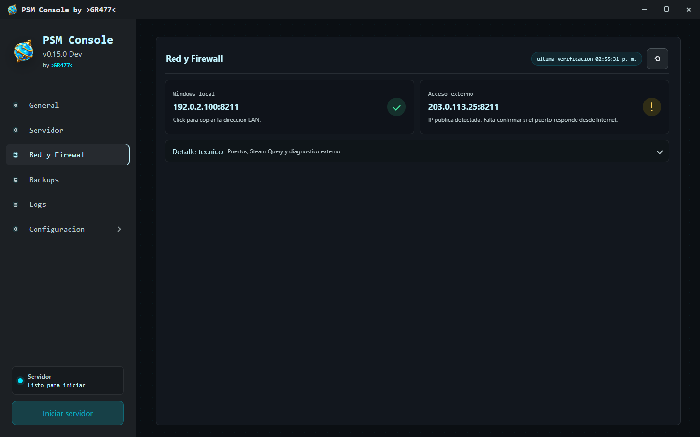

### Windows local

La dirección LAN se utiliza desde otros equipos conectados a la misma red. El diagnóstico revisa:

- Puerto UDP de jugadores.
- Reglas de entrada del Firewall de Windows.
- Puerto local de Steam Query.
- Dirección IPv4 local.

Si falta una regla, presiona **Configurar Windows** y confirma la operación. Windows puede mostrar el cuadro de Control de cuentas de usuario; esa confirmación no se oculta ni se automatiza.

### Acceso externo

La dirección pública permite que jugadores externos intenten conectarse. Para funcionar, también puede requerir:

- Reenvío del puerto UDP en el router.
- Ausencia de CGNAT por parte del proveedor.
- Servidor en ejecución durante la prueba.

Una advertencia externa es informativa y no impide iniciar el servidor.

### Direcciones de las capturas

Las capturas usan:

- `192.0.2.100` como ejemplo local.
- `203.0.113.25` como ejemplo público.

Ambas pertenecen a rangos reservados para documentación.

## 6. Iniciar y detener el servidor

El botón principal se encuentra en la parte inferior de la barra lateral.

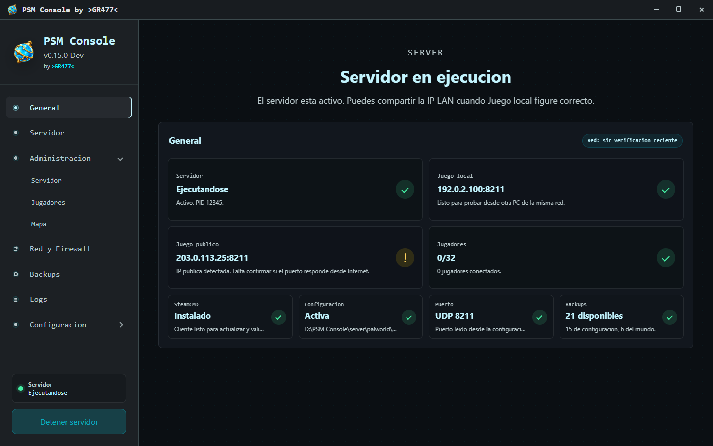

### Iniciar

1. Comprueba que SteamCMD, el servidor y el INI estén disponibles.
2. Presiona **Iniciar servidor**.
3. Confirma la operación.
4. Revisa el estado hasta que indique **Ejecutándose**.

PSM Console valida conflictos locales importantes antes de iniciar. Las advertencias de conectividad externa no bloquean esta acción.

### Detener

1. Presiona **Detener servidor**.
2. Confirma la operación.
3. Espera a que el estado vuelva a **Listo para iniciar**.

Detener desde la aplicación permite identificar y cerrar los procesos relacionados con Palworld. Evita terminar procesos manualmente desde el Administrador de tareas salvo que la aplicación indique un error.

## 7. Administración en ejecución

El grupo **Administración** aparece cuando el servidor está ejecutándose y la API REST local está disponible.

### Servidor

Permite:

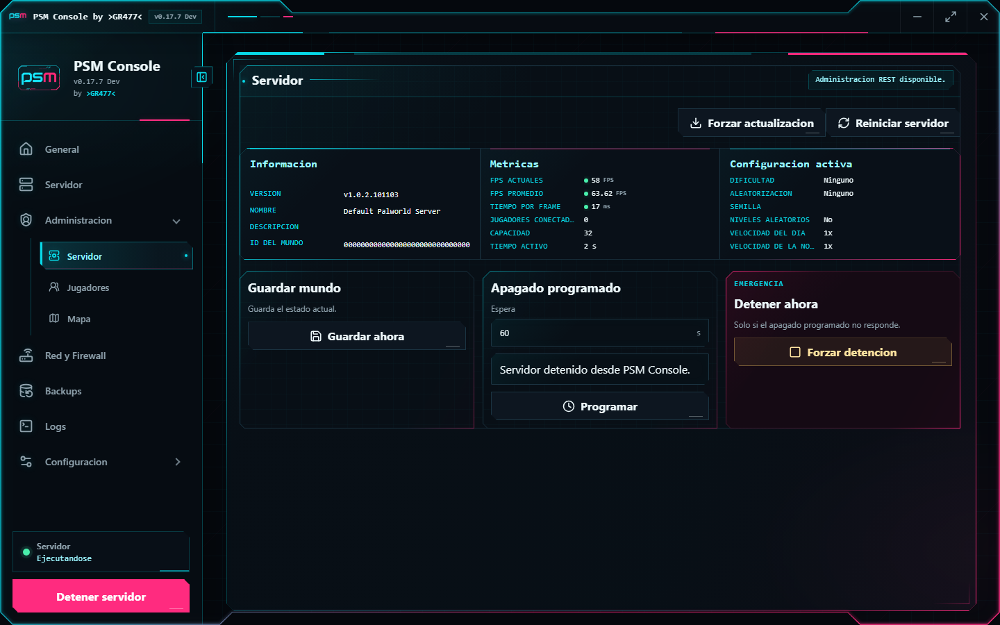

- Consultar información, métricas y configuración reportadas por el servidor.
- Guardar el mundo manualmente.
- Programar un apagado con tiempo y mensaje.
- Reiniciar el servidor.
- Forzar la detención en una emergencia.

Usa la detención de emergencia solamente si el apagado normal no responde.

### Jugadores

Permite:

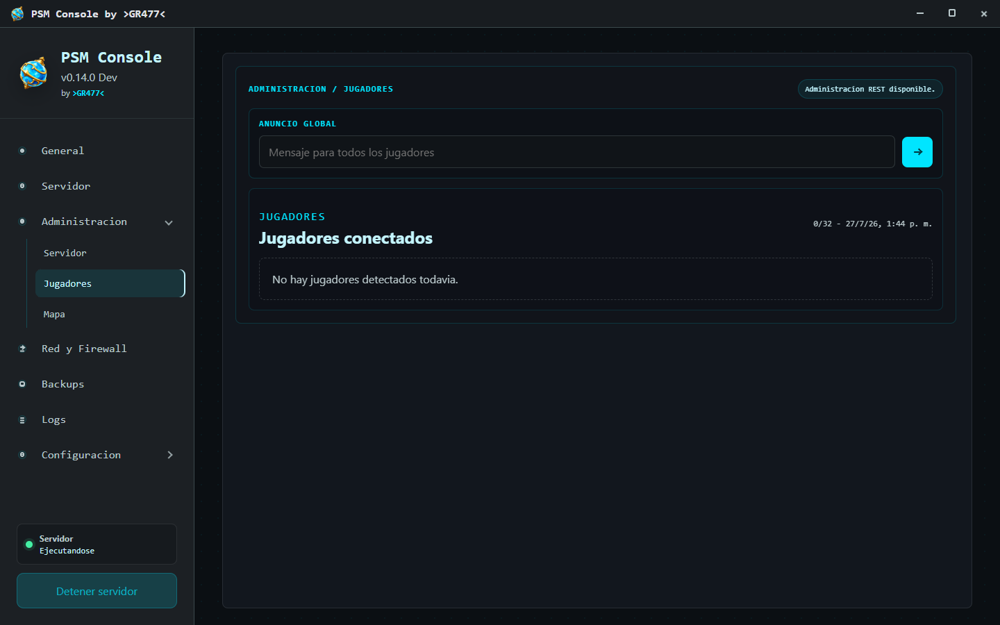

- Ver jugadores conectados y vistos anteriormente.
- Consultar ping e identificadores disponibles.
- Enviar un anuncio global.
- Expulsar a un jugador conectado.
- Banear o desbanear jugadores identificados.

Las acciones administrativas pueden requerir confirmación. El botón de expulsión solo está disponible para jugadores conectados.

### Mapa

Muestra una representación relativa de las coordenadas reportadas por la API REST. No reemplaza el mapa oficial del juego y solo aparecen jugadores con coordenadas disponibles.

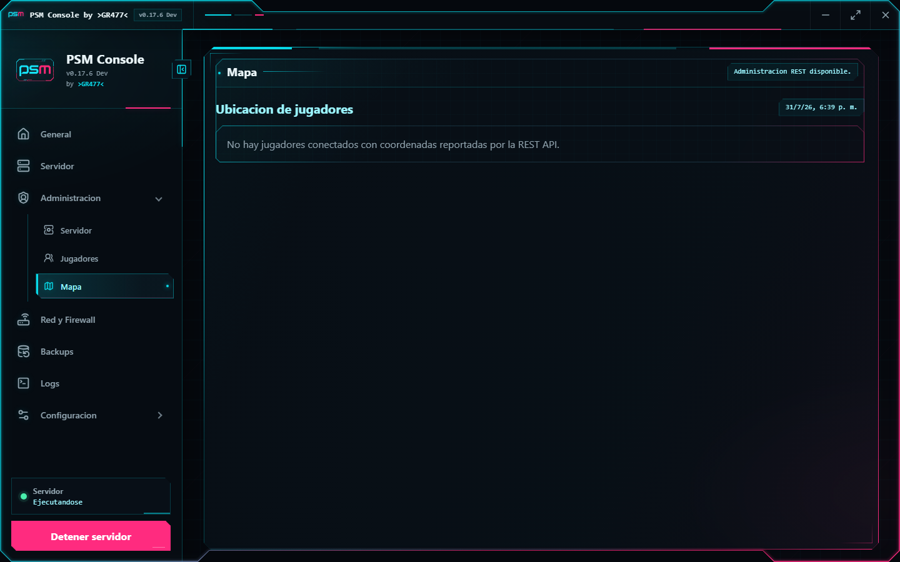

## 8. Backups

Backups reúne las copias de la configuración y de la partida.

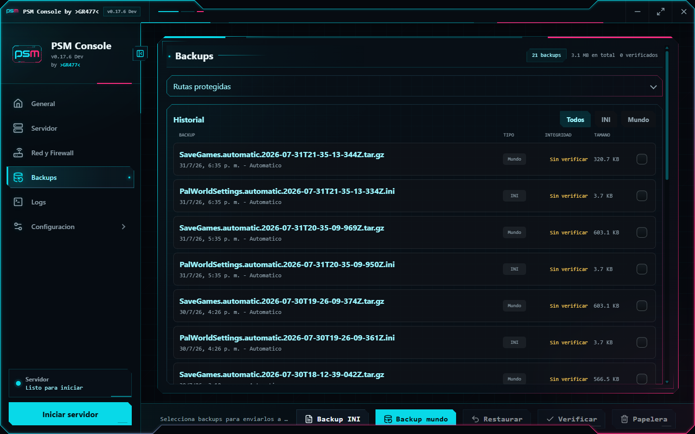

### Crear una copia

- **Backup INI:** copia `PalWorldSettings.ini`.
- **Backup mundo:** copia y, según la preferencia activa, comprime la partida.

Cada operación requiere confirmación.

### Filtrar y seleccionar

Usa los filtros **Todos**, **INI** y **Mundo**. Marca uno o varios elementos mediante sus casillas para habilitar acciones grupales.

### Verificar

La verificación comprueba la integridad registrada del backup. Un elemento puede aparecer como:

- **Verificado**
- **Sin verificar**
- **Dañado**

No restaures un backup marcado como dañado.

### Restaurar

1. Detén el servidor.
2. Selecciona un único backup.
3. Presiona **Restaurar**.
4. Revisa el origen y confirma.

La aplicación crea las protecciones previstas antes de reemplazar información activa.

### Enviar a la papelera

Selecciona uno o varios backups y presiona **Papelera**. Los elementos se envían a la Papelera de reciclaje de Windows para permitir su recuperación accidental.

## 9. Logs

Logs muestra los eventos de la sesión actual:

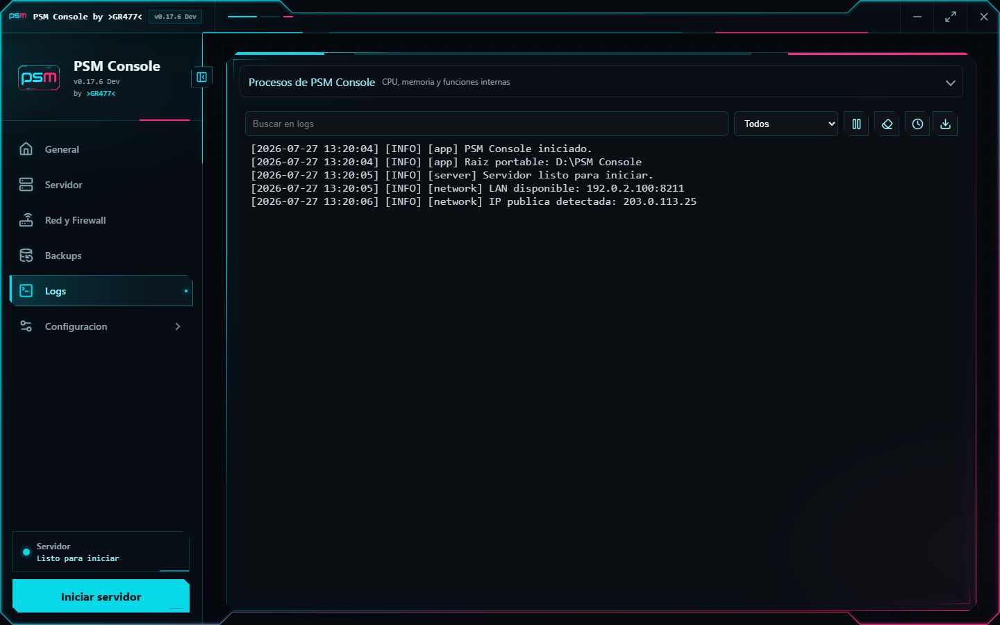

- Preparación del entorno.
- Descargas e instalaciones.
- Inicio y detención del servidor.
- Operaciones administrativas.
- Errores y advertencias.

### Historial

Presiona el botón de historial para abrir registros anteriores. La aplicación conserva un máximo de diez archivos de log.

Después de abrir uno anterior, usa **Volver al log actual** para retomar la sesión en curso.

### Exportar

El botón de exportación guarda el contenido visible en un archivo de texto. Antes de compartirlo, revisa si contiene rutas, direcciones o identificadores de jugadores.

## 10. Configuración de la aplicación

Este grupo contiene preferencias de PSM Console, separadas de la configuración de Palworld.

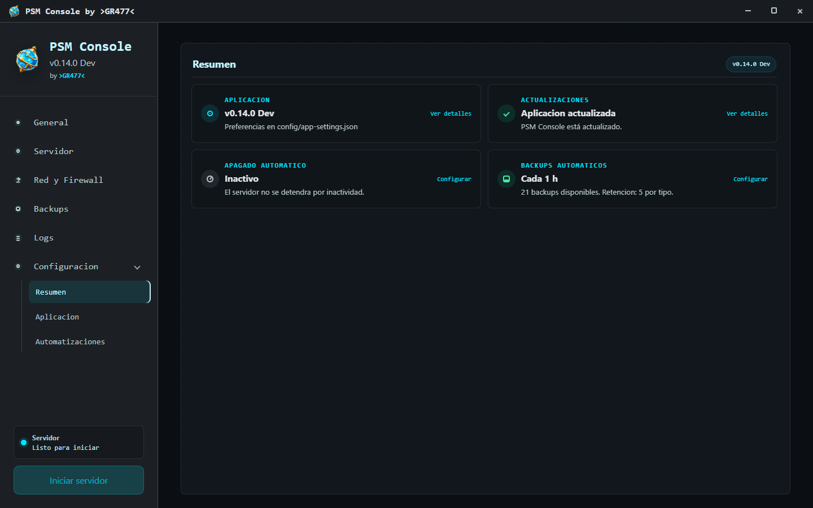

### Resumen

Muestra:

- Versión actual.
- Estado de actualizaciones.
- Estado del apagado automático.
- Frecuencia y cantidad de backups.
- Estado de la API web administrativa.

Cada tarjeta abre la subsección correspondiente.

### Aplicación

Informa la raíz portable y las ubicaciones relativas de:

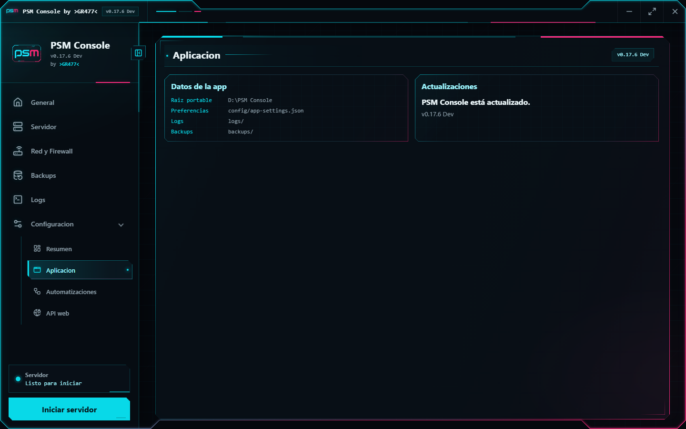

- Preferencias.
- Logs.
- Backups.

También muestra si existe una nueva versión disponible.

### Automatizaciones

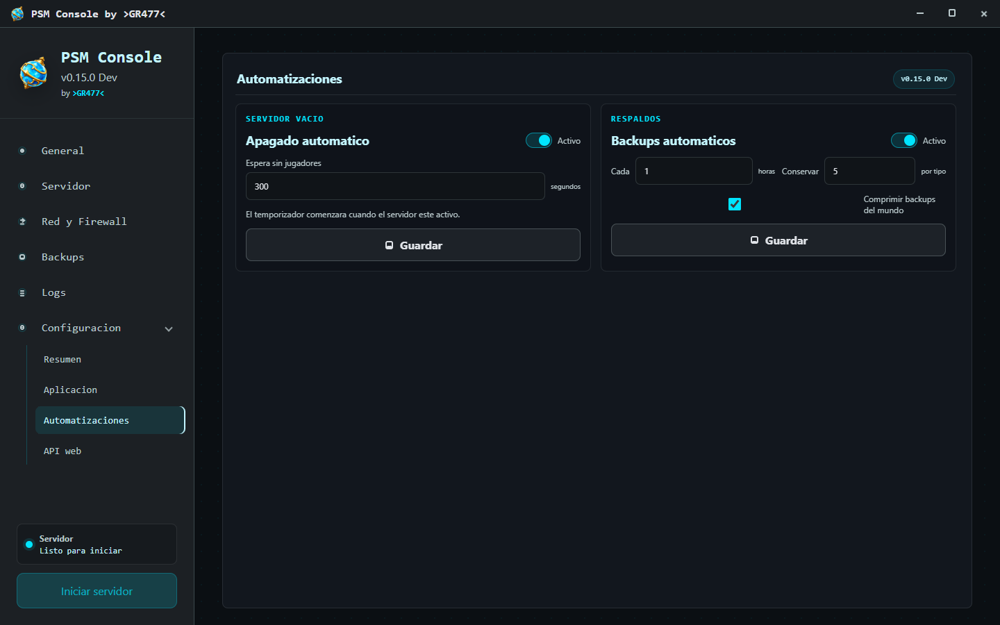

#### Apagado automático

Al activarlo, define cuántos segundos debe permanecer el servidor sin jugadores antes de detenerse.

El conteo comienza solamente cuando el servidor está ejecutándose, el monitor de jugadores está disponible y no quedan jugadores conectados.

#### Backups automáticos

Permite definir:

- Intervalo en horas.
- Cantidad conservada por tipo.
- Compresión de backups del mundo.

Los cambios no se aplican hasta confirmar **Guardar**.

### API web

Esta opción habilita una única conexión web compartida por dos perfiles:

- **API administrativa:** acceso completo a las funciones web.
- **API cliente:** acceso limitado a las funciones que habilites desde PSM Console.

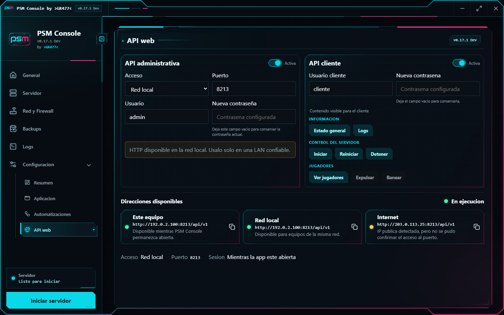

1. Abre **Configuración > API web**.
2. Elige **Solo este equipo** para pruebas locales o **Red local** para acceder desde otro equipo de la misma LAN.
3. Define un puerto entre `1024` y `65535`.
4. Configura el usuario administrativo y una contraseña de al menos cinco caracteres.
5. Activa la API administrativa.

La API administrativa y la API cliente utilizan el mismo puerto. Cada perfil conserva su propio usuario y contraseña.

Los cambios comunes se guardan automáticamente. Para cambiar un usuario o una contraseña, completa el campo y presiona `Enter`. Si el campo de contraseña queda vacío, se conserva la contraseña actual sin reiniciar el servicio.

La contraseña se almacena como un hash con salt y nunca vuelve a mostrarse. Tanto la contraseña administrativa como la del cliente deben tener entre cinco y 128 caracteres.

### Acceso desde el navegador

Al abrir la dirección configurada se muestra el acceso web con la identidad visual de PSM Console:

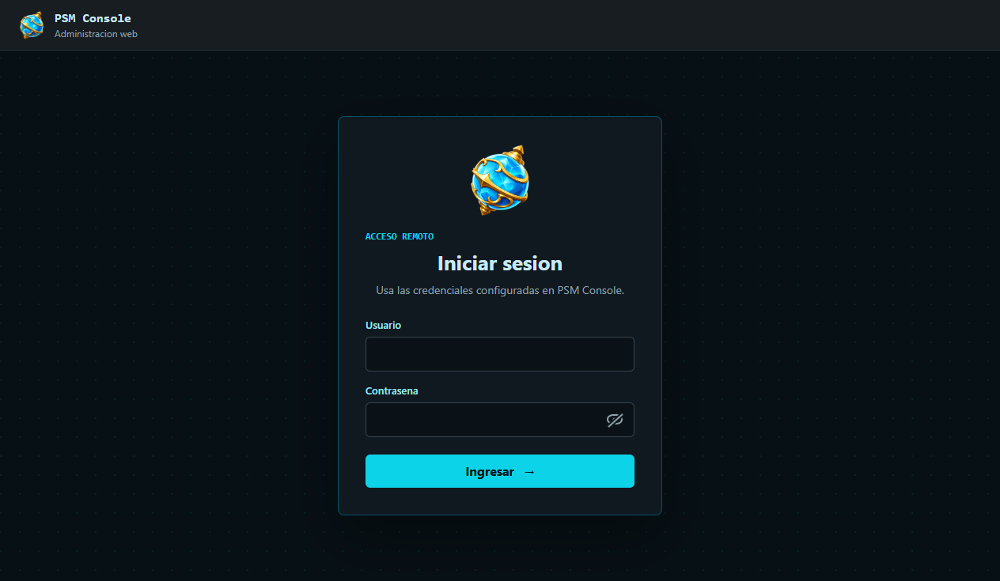

Las capturas utilizan credenciales y datos simulados. El usuario y la contraseña reales son los configurados en la aplicación.

### Permisos del cliente

Al habilitar la API cliente, selecciona las acciones disponibles:

- Consultar el estado general.
- Consultar los logs.
- Iniciar, reiniciar o detener el servidor de forma independiente.
- Ver jugadores conectados.
- Expulsar jugadores.
- Banear jugadores.

Los permisos se aplican en tiempo real. Si una función se deshabilita mientras el cliente conserva esa pantalla abierta, la siguiente operación devuelve **No permitido** y actualiza la vista.

El perfil administrativo conserva todas las secciones y controles:

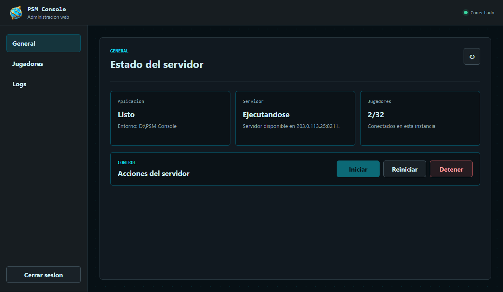

El perfil cliente muestra únicamente las secciones y acciones habilitadas. La interfaz también se adapta a navegadores móviles:

<p align="center">
  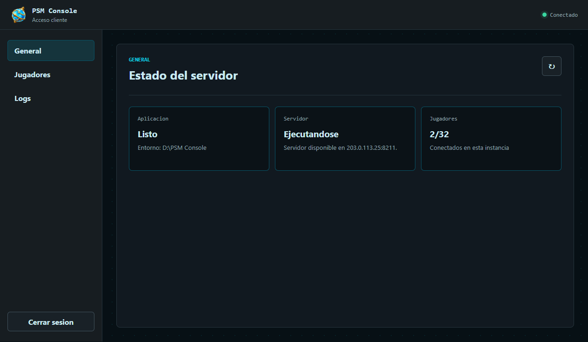
  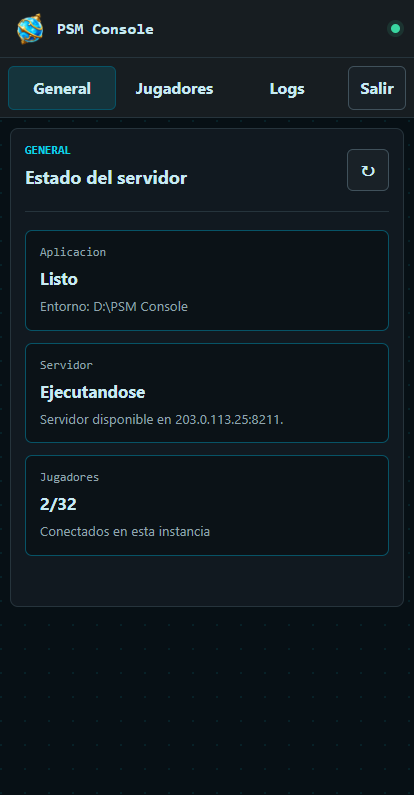
</p>

### Firewall y direcciones

En **Solo este equipo**, la API escucha únicamente en `127.0.0.1` y no necesita una regla de entrada.

En **Red local**, PSM Console comprueba el Firewall de Windows. Si falta la regla TCP del puerto compartido, solicita confirmación y muestra el cuadro de Control de cuentas de usuario para crearla.

Cuando queda habilitada, PSM Console inicia la API automáticamente al abrir la aplicación. El estado muestra la URL base, por ejemplo:

```text
http://192.0.2.100:8213/api/v1
```

La comprobación de direcciones se realiza progresivamente:

1. **Este equipo:** confirma que la API responde localmente.
2. **Red local:** confirma la dirección LAN cuando ese alcance está habilitado.
3. **Internet:** detecta la dirección pública e intenta comprobar el puerto TCP.

Haz clic sobre una dirección disponible para copiarla. El acceso por Internet requiere además reenviar el puerto TCP en el router; PSM Console no modifica el router.

Abre la URL base en el navegador. PSM Console muestra una pantalla de acceso adaptada a escritorio y móvil. Las credenciales determinan automáticamente si la sesión corresponde al perfil administrativo o al cliente.

La sesión no tiene un vencimiento por tiempo. Permanece disponible mientras PSM Console siga abierta y el token continúe guardado en la pestaña actual. Cerrar sesión, cerrar la pestaña o reiniciar la aplicación invalida su continuidad.

El endpoint `/api/v1/health` permite comprobar que el servicio responde sin autenticación. El resto de los endpoints administrativos requiere una sesión válida.

> La API utiliza HTTP, no HTTPS. El navegador puede identificar la conexión como no segura. Usa **Red local** solamente en una red confiable y evita exponer el puerto directamente a Internet sin una capa segura adicional.

## 11. Actualizaciones

PSM Console consulta las versiones publicadas en GitHub. Cuando existe una nueva:

1. La aplicación muestra una notificación.
2. Presiona **Ver release**.
3. Descarga el nuevo portable.
4. Cierra la versión anterior.
5. Coloca el nuevo ejecutable en la misma carpeta.

No elimines las carpetas `server/`, `config/`, `backups/` ni `logs/`. El portable nuevo reutiliza los datos existentes.

## 12. Problemas frecuentes

### El servidor no inicia

- Revisa Logs para encontrar el motivo.
- Comprueba si el puerto Steam Query está ocupado por otra instancia.
- Detén procesos anteriores desde la opción ofrecida por la aplicación.
- Verifica que el INI siga siendo válido.

### Puedo jugar por LAN, pero no desde Internet

- Confirma que compartiste la dirección pública, no la LAN.
- Revisa el reenvío UDP del router.
- Comprueba si tu proveedor utiliza CGNAT.
- Ejecuta la prueba externa mientras el servidor está activo.

La aplicación no puede modificar el router ni eliminar restricciones del proveedor.

### Windows sigue mostrando una regla faltante

- Vuelve a ejecutar **Configurar Windows**.
- Acepta el cuadro de Control de cuentas de usuario.
- Espera a que termine el diagnóstico.
- Revisa que la regla corresponda al protocolo y puerto configurados.

### Windows protege el equipo al abrir el portable

Las versiones actuales pueden mostrar una advertencia de SmartScreen porque el ejecutable todavía no posee una firma Authenticode pública.

- Descarga el portable únicamente desde los Releases oficiales del repositorio.
- Comprueba que el nombre y la versión correspondan con la publicación.
- No desactives SmartScreen de forma permanente.
- La firma digital se incorporará cuando el proyecto disponga de una alternativa pública confiable.

### La administración no aparece

- Confirma que el servidor esté ejecutándose.
- Espera a que la API REST local quede disponible.
- Revisa que la contraseña administrativa no esté vacía.
- Consulta Logs si el monitor no puede conectarse.

### Cambié el INI y no veo el efecto

- Confirma que presionaste **Guardar**.
- Reinicia el servidor cuando el parámetro lo requiera.
- Evita editar el archivo externamente mientras el formulario contiene cambios pendientes.

### Dónde pedir ayuda

Al reportar un problema incluye:

- Versión de PSM Console.
- Paso que estabas realizando.
- Mensaje visible.
- Log exportado y revisado.

No publiques contraseñas, IP privadas reales, tokens, identificadores sensibles ni datos personales de jugadores.

[Volver al README principal](../../README.md)
